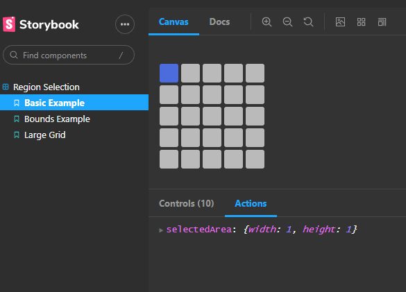

# react-grid-select

A React component to select a grid size from an available space

[![version][version-badge]][package] [![Monthly downloads][npmstats-badge]][npmstats] [![Build Status][build-badge]][build-page] [![MIT License][license-badge]][license] [![PRs Welcome][prs-badge]][prs]

## Example

## Demo

Check out the examples:

- [Basic example](https://hacksore.github.io/react-grid-select/?path=/story/region-selection--basic-example)
- [Example with bounds](https://hacksore.github.io/react-grid-select/?path=/story/region-selection--bounds-example)
- [Example with large grid](https://hacksore.github.io/react-grid-select/?path=/story/region-selection--large-grid)

## Installation

```shell
yarn add react-grid-select
```

or

```shell
npm install react-grid-select
```


## Basic usage

```js
import { GridSelect } from "react-grid-select";

const Demo = () => {
  const [selectedArea, setSelectedArea] = useState({ width: null, height: null });

  return (
    <GridSelect
      cols={5}
      rows={5}
      onRegionUpdate={setSelectedArea}
    />
  );
};
```

## Props

| Prop | Type | Default | Description |
| :- | :- | :- | :- |
| `rows`  | number  | 5 | The number of rows in the grid  |
| `cols`  | number  | 5 | The number of columns in the grid  |
| `onRegionUpdate` | Function | Log to console | Function describing what to do with the selected area information. Probably set this to a state variable |
| `cellSize` | number | 25 | Size of each grid cell in pixels |
| `bounds` | `{ maxWidthBlock: { width: number; height: number; }; maxHeightBlock: { width: number; height: number; }; };` | None | Enabled area of the grid. By default the whole grid is enabled |
| `disabled` | boolean | false | Whether or not the grid is currently disabled. Disabling will pause the grid in it's current state and apply the disabled style |
| `styles` | object | See below| Custom styles to apply to the grid |

## Styles

All default styles can be overridden by using the styles prop which accepts the below options

| Styles | Defaults |
| :----- | :----- |
| active    | `{ border: "1px solid #4d6cdd", background: "#4d6cdd" }` |
| hover     | `{ border: "1px solid #fff" }`|
| cell      | `{ width: cellSize, height: cellSize, background: "#bababa", cursor: "pointer", borderRadius: 3, border: "1px solid #bababa" }`|
| grid      | `{ position: "relative", display: "grid", color: "#444", margin: "25px 0", gridGap: "4px 6px", gridTemplateColumns: Array(cols).fill(`${cellSize}px`).join(" ") }`|
| disabled  | `{ filter: "brightness(0.7)" }` |

## License

[MIT](https://github.com/ricardo-ch/react-grid-select/blob/master/LICENSE)

[npm]: https://www.npmjs.com/
[node]: https://nodejs.org
[version-badge]: https://img.shields.io/npm/v/react-grid-select.svg?style=flat-square
[package]: https://www.npmjs.com/package/react-grid-select
[downloads-badge]: https://img.shields.io/npm/dm/react-grid-select.svg?style=flat-square
[npmstats]: http://npm-stat.com/charts.html?package=react-grid-select&from=2018-06-18
[npmstats-badge]: https://img.shields.io/npm/dm/react-grid-select.svg?style=flat-square
[gzip-badge]: http://img.badgesize.io/https://unpkg.com/react-grid-select/umd/react-grid-select.min.js?compression=gzip&style=flat-square&1
[license-badge]: https://img.shields.io/badge/license-MIT-blue.svg?style=flat-square
[license]: https://github.com/ricardo-ch/react-grid-select/blob/master/LICENSE
[prs-badge]: https://img.shields.io/badge/PRs-welcome-brightgreen.svg?style=flat-square
[prs]: http://makeapullrequest.com
[build-page]: https://github.com/Hacksore/drone-mobile/actions?query=workflow%3ANPM
[build-badge]: https://img.shields.io/github/workflow/status/Hacksore/react-grid-select/NPM
